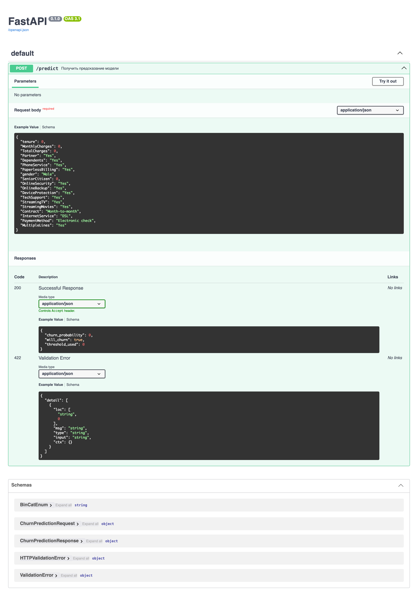

# Telco Customer Churn — прогноз оттока клиентов

ML-сервис для прогнозирования оттока клиентов телеком-компании: полный цикл
от анализа данных до задеплоенного в Docker FastAPI-приложения.

## Стек

Python · pandas · scikit-learn · FastAPI · pydantic · pytest · Docker

## Датасет

[Telco Customer Churn](https://www.kaggle.com/datasets/blastchar/telco-customer-churn) (Kaggle) - 7043 клиента телеком-компании, целевая переменная `Churn` (ушёл/остался).

## Структура проекта

```
telco-churn-project/
├── data/
│   ├── raw/                          # исходный CSV
│   └── processed/                    # train/test после feature engineering
├── notebooks/
│   ├── 01_eda.ipynb                  # разведочный анализ данных
│   ├── 02_feature_engineering.ipynb
│   └── 03_modeling.ipynb             # обучение, подбор гиперпараметров, оценка
├── models/
│   └── churn_model.pkl               # финальный pipeline + threshold + feature_columns
├── src/
│   ├── constants.py                  # общие константы (DEPENDED_FEATURES, MODEL_PATH)
│   ├── ml/
│   │   └── preprocessing.py          # feature engineering для инференса
│   └── api/
│       ├── main.py                   # FastAPI-приложение, эндпоинт /predict
│       ├── dependencies.py           # загрузка модели при старте (lifespan)
│       └── shemas.py                 # pydantic-схемы запроса/ответа
├── tests/
│   ├── test_preprocessing.py
│   └── test_api.py
├── .dockerignore
├── .gitignore
├── Dockerfile
├── LICENSE
├── pypeoject.toml
├── README.md
└── requirements.txt
```

## Ключевые находки EDA

- Целевая переменная несбалансирована: около 26-27% клиентов уходят.
- Пропуски в `TotalCharges` (11 строк) оказались не случайными — все относятся к
  клиентам с `tenure = 0` (только что подключившиеся, ещё не совершившие ни одной
  оплаты). Заполнены нулём.
- Тип контракта и способ оплаты — сильнейшие предикторы оттока: клиенты на
  помесячном контракте и с оплатой через Electronic check уходят значительно чаще.
- Признаки дополнительных интернет-услуг (`OnlineSecurity`, `TechSupport` и т.д.)
  структурно зависят от `InternetService` — при отсутствии интернета они принимают
  отдельное значение "No internet service", что создаёт избыточность.
- `tenure`, `MonthlyCharges` и `TotalCharges` сильно коррелируют между собой
  (`TotalCharges` ≈ `tenure` × `MonthlyCharges`).

## Feature engineering

- Приведение `TotalCharges` к числовому типу, заполнение пропусков нулём.
- Схлопывание "No internet service" в "No" для признаков, зависящих от `InternetService`.
- Бинаризация `PaymentMethod` → `Electronic_check` (0/1), так как остальные способы оплаты показали схожую вероятность оттока.
- Удаление слабо влияющих на таргет признаков: `gender` (этические соображения + низкая значимость), `PhoneService`, `MultipleLines`.
- Разбиение на train/test (стратифицированное, с сохранением пропорции классов).

## Модель

| Параметр | Значение |
|---|---|
| Алгоритм | Логистическая регрессия (`class_weight='balanced'`) |
| Регуляризация | L2, `C = 0.001` |
| Метрика для подбора гиперпараметров | F2-score (`fbeta_score`, `beta=2`) |
| Порог классификации | 0.435 |

**Почему F2:** ошибки асимметричны по стоимости — пропустить клиента, который уйдёт, обходится компании дороже, чем предложить скидку лояльному клиенту по ошибке. F2 взвешивает recall выше precision, но, в отличие от чистого recall, не позволяет модели "вырождаться" в тривиальный предиктор (всегда предсказывающий отток) — такая модель дала бы recall = 1.0, но крайне низкий precision и, соответственно, низкий F2.

Сравнивались логистическая регрессия, SVM, случайный лес и градиентный бустинг через 5-фолдовую стратифицированную кросс-валидацию; логрег показал лучший результат по F2.

## Результаты на отложенной test-выборке

| Метрика | Значение |
|---|---|
| Precision | 0.424 |
| Recall | 0.914 |
| F2-score | 0.742 |
| ROC-AUC | 0.732 |

Confusion matrix:

|  | Предсказано: остался | Предсказано: ушёл |
|---|---|---|
| **Факт: остался** | 854 | 698 |
| **Факт: ушёл** | 48 | 513 |

Модель улавливает подавляющее большинство реально уходящих клиентов (91.4% recall),
ценой заметной доли ложных срабатываний (precision 42.4%) — осознанный компромисс,
отражающий приоритет "не пропустить уходящего клиента" над "не побеспокоить лояльного".

## API

Один эндпоинт `POST /predict`, принимающий сырые данные клиента (в формате
исходного датасета) и возвращающий вероятность оттока, финальное решение и
использованный порог классификации. Полная интерактивная документация — на
`/docs` (Swagger UI) после запуска сервиса.

Входные данные валидируются на двух уровнях: pydantic-схема (типы, допустимые
значения категорий, согласованность полей — например, зависимые от интернета
признаки не могут быть "Yes" при `InternetService=No`) и доменная валидация
внутри `preprocessing.py` (например, `TotalCharges` не может быть пустым при
ненулевом `tenure`).

Скриншот `/docs`:


## Запуск

### Через Docker (рекомендуемый способ)

```bash
docker build -t telco-churn-api .
docker run -p 8000:8000 telco-churn-api
```

Сервис будет доступен на `http://127.0.0.1:8000/docs`.

### Локально, для разработки

```bash
python -m venv .venv
source .venv/bin/activate
pip install -r requirements.txt

uvicorn src.api.main:app --reload
```

### Тесты

```bash
pytest
```

Покрывают предобработку данных ([`test_preprocessing.py`](./tests//test_preprocessing.py)) и API целиком,
включая валидацию pydantic-схемы и кросс-полевые проверки ([`test_api.py`](./tests/test_api.py)).

### Воспроизведение обучения модели

Ноутбуки выполняются по порядку: [`01_eda`](./notebooks//01_eda.ipynb) → [`02_feature_engineering`](./notebooks/02_feature_engineering.ipynb) → [`03_modeling`](./notebooks/03_modeling.ipynb). Финальный артефакт (pipeline + порог + список признаков) сохраняется в [`models/churn_model.pkl`](./models/churn_model.pkl).

# Лицензия

MIT License. Подробнее см. в файле [LICENSE](./LICENSE).
